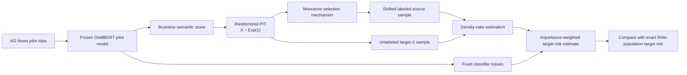
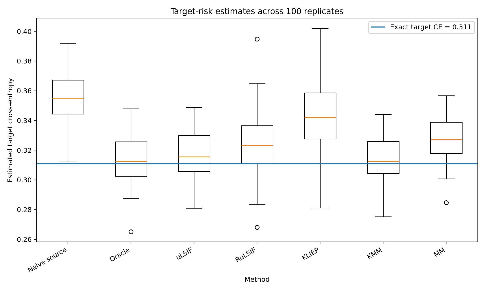
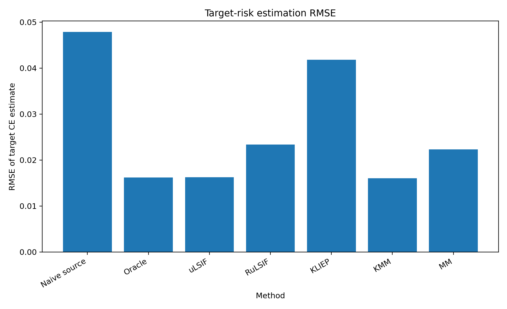

# Target-Risk Estimation under Semantic Covariate Shift

This project studies **model evaluation under covariate shift** using a Transformer-based text classification setting.

A fixed DistilBERT classifier is evaluated under a controlled semantic distribution shift on the AG News dataset. I construct a Transformer-derived semantic score, generate a shifted source distribution, estimate target-to-source density ratios with several methods, and use importance weighting to estimate the classifier's target-domain cross-entropy risk.

The main finding is that **naive source-domain evaluation is substantially biased under semantic covariate shift**, while density-ratio weighting can recover target risk much more accurately.

## Project overview



## Situation

AI models are often evaluated on data drawn from a different distribution than the one encountered after deployment. Under covariate shift,

$$
P_s(X) \neq P_t(X), \qquad P_s(Y\mid X)=P_t(Y\mid X),
$$

so source-domain evaluation may not accurately represent target-domain performance.

This project focuses on a practical question:

> Can labeled source data and unlabeled target covariates be used to estimate the target-domain performance of a fixed Transformer classifier?

## Approach

### 1. Train an independent pilot Transformer

I train a DistilBERT sequence classifier on a balanced subset of the AG News training split that is disjoint from the benchmark data.

The DistilBERT encoder is frozen and only the classification head is trained. The resulting model is used as a fixed pilot/deployed classifier.

### 2. Construct a semantic covariate

For each benchmark text $T$, I define

$$
S(T)=P_{\text{pilot}}(\text{Business}\mid T),
$$

which provides a continuous Transformer-derived semantic score.

A randomized empirical probability-integral transform maps this score to

$$
X\sim \mathrm{Exp}(1)
$$

under the finite empirical target population.

### 3. Generate covariate shift

Source observations are sampled through the monotone selection probability

$$
v_b(x) =
0.2+
0.8\frac{10x+1}{10x+1+b},
$$

with $b=12$.

The corresponding oracle target-to-source density ratio is

$$
w(x) =
\frac{p_t(x)}{p_s(x)} =
\frac{Z}{v_b(x)}.
$$

### 4. Estimate density ratios

I compare:

- **Oracle weights**
- **uLSIF**
- **RuLSIF**
- **KLIEP**
- **Kernel Mean Matching (KMM)**
- **MM**, a monotone shape-constrained estimator

### 5. Estimate target risk

For a fixed classifier with per-example cross-entropy loss $\ell_i$, target risk is estimated with self-normalized importance weighting:

$$
\widehat R_t =
\frac{\sum_i \hat w_i\ell_i}
     {\sum_i \hat w_i}.
$$

The experiment is repeated 100 times and compared with the exact finite-population target risk.

## Results

The exact target cross-entropy risk is approximately **0.3110**.

| Method | Valid runs | Bias | MAE | RMSE |
|---|---:|---:|---:|---:|
| Naive source | 100 | 0.0452 | 0.0452 | 0.0479 |
| Oracle | 100 | 0.0035 | 0.0133 | 0.0162 |
| uLSIF | 100 | 0.0052 | 0.0132 | 0.0163 |
| RuLSIF | 100 | 0.0128 | 0.0183 | 0.0234 |
| KLIEP | 100 | 0.0330 | 0.0345 | 0.0418 |
| KMM | 94 | 0.0031 | 0.0131 | 0.0160 |
| MM | 100 | 0.0174 | 0.0187 | 0.0223 |

Naive source evaluation has an RMSE of about **0.0479**. uLSIF reduces this to **0.0163**, close to the oracle result of **0.0162**.

KMM achieves comparable accuracy when successful, but produces invalid negative weights in 6 of 100 runs. MM is numerically stable in all runs and achieves high correlation with the oracle weights, but its estimated weights are less variable, leading to some under-correction.

### Target-risk estimates



### RMSE comparison



## Repository structure

```text
.
├── README.md
├── report/
│   ├── report.pdf
│   ├── report.tex
│   └── references.bib
├── figures/
│   ├── target_risk_estimates_boxplot.png
│   └── target_risk_rmse.png
├── results/
│   └── project_results_summary.csv
├── src/
│   ├── train_semantic_pilot_frozen.py
│   ├── compute_semantic_scores_frozen.py
│   ├── make_semantic_covariate_shift.py
│   ├── create_target_loss_lookup.py
│   ├── run_repeated_risk_experiment_v3.R
│   └── MM_function.R
├── requirements.txt
└── .gitignore
```

Large model checkpoints, virtual environments, Hugging Face caches, and generated intermediate datasets are intentionally excluded from the repository.

## Reproducing the pipeline

Run the scripts from the project root in the following order.

### Python environment

```bash
python -m venv .venv
source .venv/bin/activate
pip install -r requirements.txt
```

### 1. Train the pilot model

```bash
python src/train_semantic_pilot_frozen.py
```

### 2. Compute Transformer-derived semantic scores

```bash
python src/compute_semantic_scores_frozen.py
```

### 3. Construct the semantic covariate shift

```bash
python src/make_semantic_covariate_shift.py
```

### 4. Precompute fixed-classifier losses

```bash
python src/create_target_loss_lookup.py
```

### 5. Run the repeated density-ratio experiment

The R experiment requires the packages used by the benchmark estimators, including `densityratio` and `densratio`, as well as the dependencies of `MM_function.R`.

```bash
B=100 Rscript src/run_repeated_risk_experiment_v3.R
```

The main output is the replicate-level comparison of target-risk estimates and a method-level summary of bias, variance, MAE, RMSE, weight accuracy, and estimator stability.

## Key takeaways

- Distribution shift can make source-domain evaluation substantially misleading even when the prediction model itself is fixed.
- Density-ratio weighting can greatly improve target-domain risk estimation using labeled source data and unlabeled target covariates.
- uLSIF provides a strong combination of accuracy and stability in this experiment.
- KMM achieves similar risk-estimation accuracy when successful but exhibits occasional numerical failures.
- The monotone MM estimator is stable and recovers the ordering of the oracle weights well, but its conservative weight variation introduces an interpretable bias-variance tradeoff.

## Report

A concise technical report with the full project motivation, methodology, STAR-style discussion, and results is available at:

[`report/report.pdf`](report/report.pdf)

## Notes

This is a controlled semi-synthetic benchmark built on real AG News text. The target population is defined as a finite empirical population, allowing the exact target risk and oracle density ratio to be known for evaluation.

The project focuses on **evaluation under distribution shift**, rather than on demonstrating that importance weighting necessarily improves Transformer retraining accuracy.
